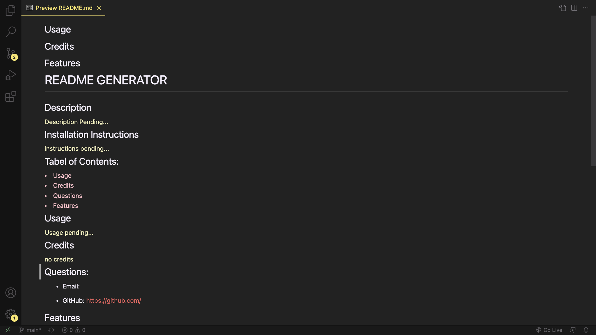

# Challenge 9 - README Generator

## Description

  
  My motivation for this project was to have the ability to quickly generate visually appealing README files that ensure I included high quality content. Throughout development I developed my skillset within object oriented design. Reflecting on this project, I feel proficient in utlising the ESM format. I will need to continue working on my organization of files.
  
  
  ## Installation Instructions
  
  
  <ol>
  <li>Ensure you have Node.js installed</li>
    <ul>
    <li>Instructions to install node: 
    <a href="https://docs.npmjs.com/downloading-and-installing-node-js-and-npm" style="color: #CCDCE2">Link to Instructions</a></li>
    </ul>
  <li>Open Terminal</li>
  <li>Enter 'Node index.js' in your command line</li>
  <li>Answer prompts with as much detail as you desire.</li>
  <li>Once all prompts are answered, the file will generate. Open your README.md Preview</li>
  <li>Check to make sure all desired content is present</li>
  <li>To make changes, open the raw code and make changes</li>
  <li>Save your changes and refresh your preview</li>
  </ol>
  
  
## Tabel of Contents:

<li>
<a href="#usage" style="color:pink">Usage</a>
</li>
<li>
<a href="#credits" style="color:pink">Credits</a>
</li>
<li>
<a href="#questions" style="color:pink">Questions</a>
</li>
<li>
<a href="#features" style="color:pink">Features</a>
</li>

## Usage

## Credits

  <ul>
  <li>
  <a href="https://www.codecademy.com/courses/learn-javascript-objects/lessons/objects/exercises/review-objects"  style="color: #CCDCE2">Code Academy Object Review</a>
  </li>
  </ul>

## Questions:

- Email:
  <a id="#questions" href="https://www.google.com/" style="color: #E85F5C">haileyraehughes89@gmail.com</a>

- GitHub:
  <a href="https://www.google.com/" style="color: #E85F5C">https://github.com/haileyraehughes89</a>
